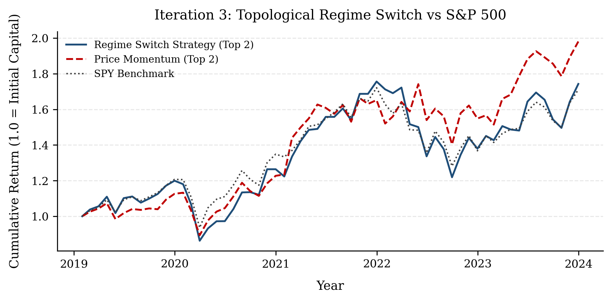
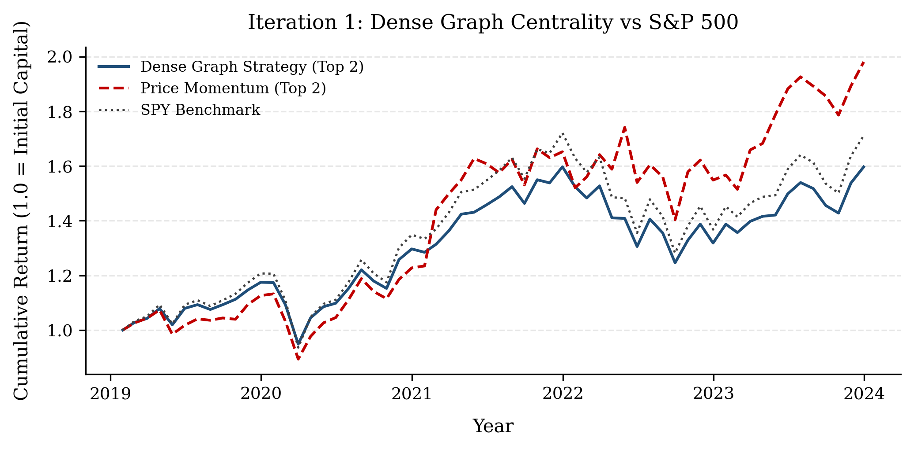
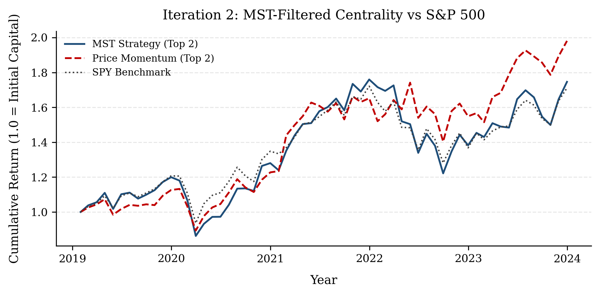
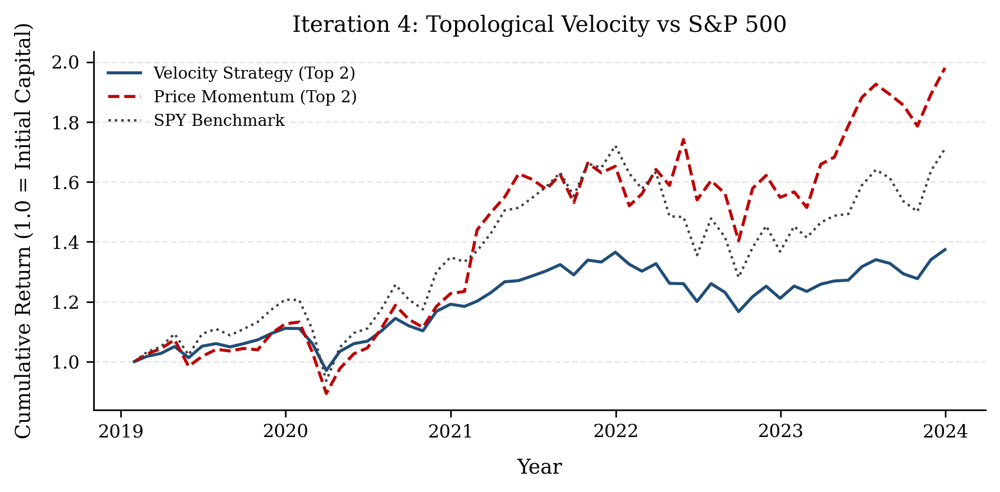
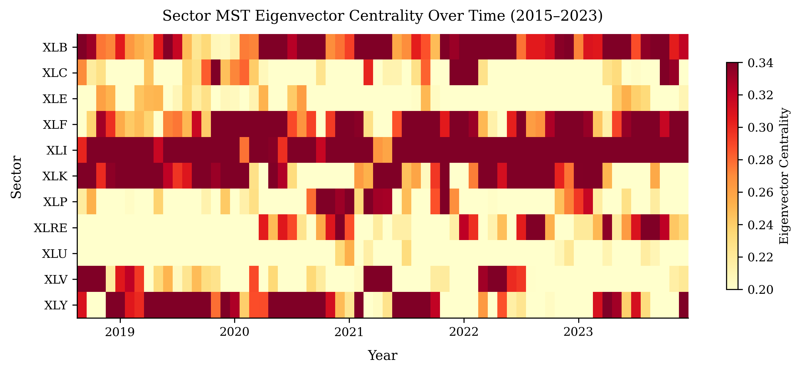
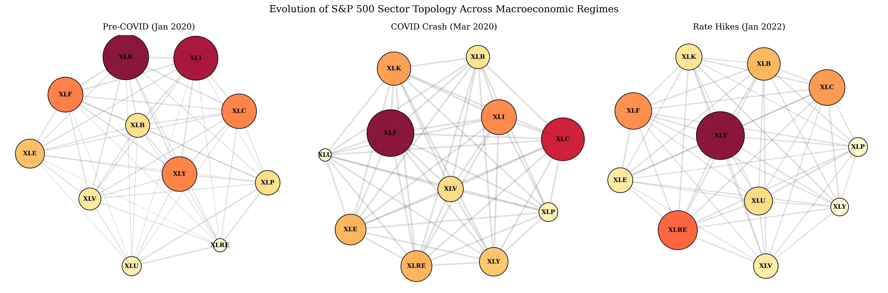

# Limitations of Topological Signals in Mega-Cap Momentum Markets
### An Iterative Network Analysis of Sector Rotation

[](https://www.python.org/)
[](LICENSE)
[](#citation)
[](https://www.bits-pilani.ac.in/goa/)
 
**Authors:** Tanishq Sahu · Vishwam Tiwari · Neena Goveas (Supervisor)  
**Institution:** Department of Computer Science and Information Systems, BITS Pilani, K.K. Birla Goa Campus

<p align="center">
  
</p>


---

## Table of Contents

- [Overview](#overview)
- [Core Hypothesis](#core-hypothesis)
- [Key Findings](#key-findings)
- [Methodology at a Glance](#methodology-at-a-glance)
- [The Four Iterations](#the-four-iterations)
  - [Iteration 1 — Dense Graph Centrality](#iteration-1--dense-graph-centrality)
  - [Iteration 2 — MST-Filtered Centrality](#iteration-2--mst-filtered-centrality)
  - [Iteration 3 — Topological Regime Switch](#iteration-3--topological-regime-switch)
  - [Iteration 4 — Centrality Velocity (ΔC)](#iteration-4--centrality-velocity-c)
- [Performance Results](#performance-results)
- [Statistical Hypothesis Tests](#statistical-hypothesis-tests)
- [Walk-Forward Validation](#walk-forward-validation)
- [Project Structure](#project-structure)
- [Installation & Usage](#installation--usage)
- [Module Reference](#module-reference)
- [Figures](#figures)
- [Why Topology Underperforms: The Mega-Cap Effect](#why-topology-underperforms-the-mega-cap-effect)
- [Takeaways for Quantitative Practitioners](#takeaways-for-quantitative-practitioners)
- [Citation](#citation)

---

## Overview

This repository contains the full source code and research paper for a 9-year empirical backtest (2015–2023) of **graph-theoretic sector rotation strategies** applied to the 11 GICS sector SPDR ETFs of the S&P 500. The work sits at the intersection of **econophysics**, **network theory**, and **quantitative asset management**.

The central question is: *can modeling the stock market as a dynamic, time-varying correlation network generate leading rotation signals that outperform classical 12-month price momentum?*

The short answer is **no** — but the *why* is both precise and instructive.

---

## Core Hypothesis

Traditional sector rotation relies on **lagging price momentum**: it reacts to capital flow only after it has already been absorbed by the market. This paper proposes that before a sector experiences a momentum-driven breakout, it first becomes **structurally critical** to the market's underlying correlation topology.

We measure this structural influence via **Eigenvector Centrality** computed over a rolling **Maximum Spanning Tree (MST)** — mathematically analogous to Google's PageRank — and hypothesize that *topology precedes price*.

---

## Key Findings

| Finding | Detail |
|---|---|
| **MST-filtered topology detects systemic stress** | Eigenvector Centrality accurately captures institutional "flight to safety" and identifies macro regime shifts before they are fully priced in |
| **Topology underperforms price momentum** | Best topological variant achieves Sharpe 0.56 vs. momentum baseline of 0.70 over 2015–2023 |
| **The gap is economically significant but statistically indeterminate** | Jobson-Korkie p-values of 0.648/0.646 — 108 monthly observations lack the power to reject H₀ at p < 0.05 |
| **The "Magnificent 7" overrides structural signals** | Extreme mega-cap concentration in XLK mathematically overrides structural macro-indicators |
| **Cash drag is the primary cost of being right** | The regime switch correctly identified stress in 2020–2021 but missed the liquidity-driven bull run that followed |
| **Centrality Velocity (ΔC) is catastrophically fragile** | Differencing an already noisy metric amplifies crisis-era noise to the point of complete strategy failure |

---

## Methodology at a Glance

### Universe

11 GICS Sector SPDR ETFs:

| Ticker | Sector |
|--------|--------|
| XLK | Information Technology |
| XLV | Health Care |
| XLF | Financials |
| XLY | Consumer Discretionary |
| XLP | Consumer Staples |
| XLE | Energy |
| XLI | Industrials |
| XLB | Materials |
| XLU | Utilities |
| XLRE | Real Estate *(live Oct 2015)* |
| XLC | Communication Services *(live Jun 2018)* |

**Period:** January 1, 2015 – December 31, 2023  
**Benchmark:** SPY (S&P 500 ETF)  
**Momentum Baseline:** Top-2 sectors by trailing 12-month cumulative return, equal-weighted, monthly rebalance

### Network Construction

Daily log returns:

$$r_{i,t} = \ln\left(\frac{P_{i,t}}{P_{i,t-1}}\right)$$

Rolling 60-day Pearson correlation matrix:

$$\rho_{i,j}(t) = \frac{\sum_{\tau=t-w}^{t}(r_{i,\tau} - \bar{r}_i)(r_{j,\tau} - \bar{r}_j)}{\sqrt{\sum(r_{i,\tau}-\bar{r}_i)^2 \sum(r_{j,\tau}-\bar{r}_j)^2}}$$

Affine transformation to ensure positive edge weights (required for Perron-Frobenius):

$$A_{i,j}(t) = \frac{1 + \rho_{i,j}(t)}{2}$$

Self-loops removed: $A_{i,i} = 0$.

### MST Extraction

Maximum Spanning Tree via Kruskal's algorithm (maximizing positively-transformed correlation weights):

$$T_t = \arg\max_{T \in \mathcal{T}} \sum_{(i,j) \in E(T)} A_{i,j}(t)$$

### Eigenvector Centrality

Computed on the sparse MST adjacency (not the dense graph) to satisfy the Perron-Frobenius theorem uniqueness condition:

$$Ax = \lambda x \quad \Longrightarrow \quad x_v(t) = \frac{1}{\lambda} \sum_{u \in V} A_{v,u}(t) \cdot x_u(t)$$

---

## The Four Iterations

### Iteration 1 — Dense Graph Centrality

Centrality applied directly to the full 11×11 correlation graph. During market-wide shocks (e.g. March 2020), all pairwise correlations converge toward 1.0, transforming the dense network into an indistinguishable "hairball." Centrality scores collapse toward equality, forcing the algorithm to select sectors effectively at random. **Result: 7.00% annualised return, Sharpe 0.32.**

<p align="center">
  
</p>

---

### Iteration 2 — MST-Filtered Centrality

The MST filter strips spurious correlations, retaining only the N−1 strongest structural pathways. The centrality signal becomes far cleaner — Figure 2 shows clearly distinguishable regime shifts, including the structural dominance of Energy (XLE) during the 2022 inflation cycle. However, *holding the topological center of a crashing market still does not prevent drawdowns*: relative structural superiority offers no absolute protection. **Result: 12.55% annualised return, Sharpe 0.56, Max DD -30.59%.**

<p align="center">
  
</p>

---

### Iteration 3 — Topological Regime Switch

A binary switch function $S_t \in \{0,1\}$ liquidates entirely to cash when either defensive sector (XLU or XLP) ranks in the top-2 centrality positions:

$$S_t = \begin{cases} 0 & \text{if } \text{Rank}(x_{XLU}) \leq 2 \text{ or } \text{Rank}(x_{XLP}) \leq 2 \\ 1 & \text{otherwise} \end{cases}$$

$$R_t = S_t \cdot \frac{1}{2} \sum_{v \in \text{Top 2}} r_{v,t}$$

Horizontal plateaus in the equity curve (Figure 5) confirm successful avoidance of localized crashes. However, the binary all-or-nothing architecture triggers **severe cash drag** through the 2020–2021 ZIRP-driven bull market. During cash periods, we additionally benchmark using the actual 3-month T-bill rate (^IRX from FRED) for honest opportunity-cost accounting. **Result: 12.51% annualised return, Sharpe 0.56 (Rf=0) / 0.47 (Rf=T-bill), Max DD -30.59%.**

> **Note:** The near-identical drawdown between Iterations 2 and 3 (-30.59% for both) reveals that the March 2020 crash unfolded faster than the monthly centrality rebalance could detect — defensive sectors had not yet migrated to the network core at the moment of peak entry, so the switch remained un-triggered.

<p align="center">
  
</p>

---

### Iteration 4 — Centrality Velocity (ΔC)

Shifting from the *level* to the *kinematics* of centrality:

$$\Delta x_{v,t} = x_{v,t} - x_{v,t-1}$$

The strategy buys the two sectors gaining centrality fastest, attempting to front-run capital rotation before it is fully priced. During the March 2020 liquidity crisis, wild correlation gyrations produced massive ΔC noise. The algorithm repeatedly bought false breakouts into a crashing market. **Catastrophic failure — 6.44% annualised return, Sharpe 0.37.** This conclusively demonstrates that deriving higher-order signals from financial correlation networks without severe low-pass filtering is mathematically fragile.

<p align="center">
  
</p>

---

## Performance Results

**Consolidated Performance Metrics (2015–2023, gross of transaction costs):**

| Strategy | Ann. Return | Sharpe (Rf=0) | Sharpe (Rf=T-bill) | Max Drawdown |
|---|---|---|---|---|
| Dense Graph (Iter. 1) | 7.00% | 0.32 | — | -25.39% |
| MST Centrality (Iter. 2) | 12.55% | 0.56 | 0.56 | -30.59% |
| **Regime Switch (Iter. 3)** | **12.51%** | **0.56** | **0.47** | **-30.59%** |
| Centrality Velocity (Iter. 4) | 6.44% | 0.37 | — | -29.38% |
| **Price Momentum (Baseline)** | **14.09%** | **0.70** | **0.70** | **-21.08%** |
| SPY Benchmark | 10.89% | 0.57 | 0.57 | -25.56% |

Sharpe ratios use Rf = 0% for cross-strategy comparability. The Rf=T-bill column applies actual monthly 3-month T-bill rates only to the cash periods of Iteration 3.

**Transaction Cost Note:** At 12.5 bps institutional round-trip per trade, MST and Regime Switch strategies (monthly turnover ~15%) incur ~22 bps annual drag. Dense Graph and Velocity variants (near-total monthly reallocation, ~200% turnover) face ~300 bps annual drag, further widening the gap versus momentum.

---

## Statistical Hypothesis Tests

All tests compare topological strategies vs. the Price Momentum baseline. Computed on T = 108 monthly observations (2015–2023, 60-day window).

### (a) Jobson–Korkie Sharpe Ratio Equality Test

*H₀: Sharpe(strategy) = Sharpe(momentum). Memmel (2003) correction applied.*

| Strategy | SR (strategy) | SR (momentum) | Z-stat | p-value |
|---|---|---|---|---|
| MST Centrality (Iter. 2) | 0.641 | 0.755 | −0.457 | 0.648 |
| Regime Switch (Iter. 3) | 0.640 | 0.755 | −0.459 | 0.646 |

Neither strategy rejects H₀ at p < 0.05.

### (b) Block Bootstrap 95% CI for Annualised Sharpe

*Politis & Romano (1994) stationary bootstrap, B = 10,000, block length = 4.*

| Strategy | Sharpe | CI Lower | CI Upper | Std. Error |
|---|---|---|---|---|
| MST Centrality (Iter. 2) | 0.641 | −0.207 | 1.555 | 0.453 |
| Regime Switch (Iter. 3) | 0.640 | −0.212 | 1.551 | 0.451 |
| Price Momentum (Baseline) | 0.755 | 0.009 | 1.603 | 0.407 |
| SPY Benchmark | 0.636 | −0.075 | 1.512 | 0.405 |

Confidence intervals overlap substantially across all strategies, confirming statistical indeterminacy at T = 108.

### (c) HAC-Corrected t-test on Return Differences

*Newey–West (1987) HAC standard errors, automatic lag selection (lag = 3).*

| Strategy vs. Momentum | Ann. Diff. | HAC SE | t-stat | p-value |
|---|---|---|---|---|
| MST Centrality (Iter. 2) | −0.83% | 1.70% | −0.141 | 0.888 |
| Regime Switch (Iter. 3) | −0.88% | 1.72% | −0.147 | 0.883 |

The return deficits are economically real (~83–88 bps/year) but statistically indeterminate given sample size. This is consistent with the broader factor degradation literature (Hou, Xue & Zhang 2020).

---

## Walk-Forward Validation

An expanding-window walk-forward validation across three annual held-out folds eliminates in-sample parameter selection bias. The 60-day window was evaluated against w ∈ {30, 60, 90, 120}.

| Fold | Training Window | OOS Test Year |
|---|---|---|
| 1 | Jan 2019 – Dec 2020 | 2021 |
| 2 | Jan 2019 – Dec 2021 | 2022 |
| 3 | Jan 2019 – Dec 2022 | 2023 |

**Out-of-Sample Sharpe Ratios (Rf = 0):**

| Strategy | w | Fold 1 (2021) | Fold 2 (2022) | Fold 3 (2023) |
|---|---|---|---|---|
| MST Centrality | 30 | 3.752 | −1.034 | 0.912 |
| MST Centrality | **60** | **1.966** | **−1.027** | **1.136** |
| MST Centrality | 90 | 1.450 | −0.602 | 1.174 |
| MST Centrality | 120 | 1.420 | −0.701 | 1.055 |
| Regime Switch | 30 | 3.352 | −0.922 | 1.630 |
| Regime Switch | **60** | **2.359** | **−1.027** | **1.136** |
| Regime Switch | 90 | 0.731 | −0.471 | 1.174 |
| Regime Switch | 120 | −0.117 | −0.576 | 1.055 |

> **Important:** Per-fold Sharpe estimates are based on T = 12 monthly observations. Bootstrap SE ≈ ±1.5 at this sample size. Values exceeding 2.0 reflect concentrated single-year environments and should not be interpreted as robust estimates. The key takeaway is the **qualitative ranking** — topology underperforms momentum in every fold — which is robust and confirms the mega-cap effect is not a full-sample artifact.

No single window dominates all three regimes, consistent with regime-dependent optimal lookback sensitivity. w = 60 provides stable mid-range performance, avoiding the acute noise sensitivity of w = 30 and the excessive smoothing of w = 120.

---

## Project Structure

```
sector-rotation-via-graph-centrality/
│
├── src/
│   ├── __init__.py
│   ├── data_loader.py          # ETF + T-bill data acquisition via yfinance
│   ├── graph_builder.py        # Rolling MST construction + eigenvector centrality
│   ├── backtester.py           # Strategy execution, metrics, SPY comparison
│   ├── stats.py                # Jobson-Korkie, block bootstrap, HAC t-test
│   ├── visualizer.py           # Publication-quality figure generation (PDF + PNG)
│   └── walk_forward.py         # Expanding-window OOS cross-validation
│
├── main.py                     # Entry point — runs full pipeline
│
├── figure_1_dense_graph.png/.pdf
├── figure_2_centrality_heatmap.png/.pdf
├── figure_3_network_snapshots.png/.pdf
├── figure_4_mst_strategy.png/.pdf
├── figure_5_regime_switch.png/.pdf
├── figure_6_topological_velocity.png/.pdf
│
├── equity_curve.png
├── equity_curve_initial.png
├── equity_curve_dense_graph.png
├── equity_curve_before_regime_switching.png
├── equity_curve_after_regime_switching.png
│
└── Limitations_of_Topological_Signals_in_Mega_Cap_Momentum_Markets.pdf
```

---

## Installation & Usage

### Prerequisites

- Python 3.9+
- Internet connection (yfinance pulls live data from Yahoo Finance and FRED)

### Install dependencies

```bash
git clone https://github.com/<your-username>/sector-rotation-via-graph-centrality.git
cd sector-rotation-via-graph-centrality
python -m venv venv
source venv/bin/activate        # Windows: venv\Scripts\activate
pip install -r requirements.txt
```

**Core dependencies:**

```
yfinance>=0.2.0
pandas>=2.0.0
numpy>=1.24.0
networkx>=3.0
matplotlib>=3.7.0
scipy>=1.11.0
```

### Run the full pipeline

```bash
python main.py
```

This will:
1. Download daily adjusted prices for all 11 sector ETFs + SPY + ^IRX (2015–2023)
2. Compute the rolling 60-day MST eigenvector centrality
3. Run all four strategy iterations + price momentum baseline
4. Print a full performance metrics table and three statistical hypothesis tests
5. Save `equity_curve.png` to the working directory
6. Generate all 6 publication figures (PDF + PNG)

### Run the walk-forward validation independently

```bash
python src/walk_forward.py
```

Prints the OOS Sharpe pivot table across all window lengths and folds.

### Run only the statistical tests

```python
from src.stats import run_all_tests
import pandas as pd

# Assumes `comparison` is a DataFrame with columns:
# 'Graph Raw', 'Graph Switch', 'Momentum', 'SPY'
run_all_tests(comparison, tbill_aligned=tbill_series)
```

---

## Module Reference

### `src/data_loader.py`

| Function | Description |
|---|---|
| `fetch_sector_returns(start_date, end_date)` | Downloads daily adjusted prices for all 11 sector ETFs. Returns a DataFrame of daily log returns. Handles both `Adj Close` and `Close` column naming across yfinance versions. |
| `fetch_tbill_rates(start_date, end_date)` | Downloads ^IRX (13-week T-bill, annualised %) from FRED via yfinance. Converts to monthly decimal rate: $(1 + r_{ann})^{1/12} - 1$. Returns a monthly-resampled Series. |

---

### `src/graph_builder.py`

| Function | Description |
|---|---|
| `get_centrality_for_window(returns_window)` | For a given returns DataFrame window: (1) computes the Pearson correlation matrix, (2) applies affine transformation $A = (1+\rho)/2$, (3) removes self-loops, (4) extracts the Maximum Spanning Tree, (5) returns eigenvector centrality scores keyed by sector ticker. |
| `calculate_rolling_centrality(returns, window=60)` | Applies `get_centrality_for_window` across every rolling window in the full returns history. Returns a DataFrame of shape `(T - window, 11)` with centrality scores. |

**Design note:** `get_centrality_for_window` uses `nx.maximum_spanning_tree` (maximizing positively-transformed correlation weights) rather than the minimum spanning tree convention used in some econophysics literature. A mutable copy of the adjacency matrix is always created (`.copy()`) to avoid read-only NumPy view errors that arise from DataFrame-to-ndarray conversion.

---

### `src/backtester.py`

| Function | Description |
|---|---|
| `calculate_metrics(returns, benchmark_returns, rf)` | Computes annualised return (geometric), annualised volatility, Sharpe ratio, max drawdown, and information ratio. Accepts `rf` as either a scalar or a monthly Series. |
| `run_momentum_baseline(returns, lookback=60, top_n=2)` | Cross-sectional price momentum: ranks sectors by trailing `lookback`-day rolling cumulative return, holds `top_n` equally-weighted, monthly rebalanced with `.shift(1)` to prevent look-ahead bias. |
| `run_backtest(returns, centrality, top_n=2)` | Master backtest function. Executes both Iteration 2 (Graph Raw — always invested) and Iteration 3 (Graph Switch — cash when defensive sectors dominate). Downloads SPY and T-bill data internally. Returns a combined comparison DataFrame with columns `Graph Raw`, `Graph Switch`, `Momentum`, `SPY`. |

**Look-ahead bias prevention:** All target holdings are computed with `.shift(1)` — signals from month $t$ are applied to returns in month $t+1$.

---

### `src/stats.py`

| Function | Description |
|---|---|
| `jobson_korkie_test(r_a, r_b, rf=0.0)` | Tests $H_0: SR_A = SR_B$ using the Memmel (2003) corrected asymptotic variance estimator. Two-tailed Z-test. Returns annualised Sharpe ratios, Z-stat, p-value. |
| `bootstrap_sharpe_ci(returns, rf=0.0, n_bootstrap=10000, confidence=0.95, block_length=None)` | Block bootstrap (Politis & Romano 1994) confidence interval for annualised Sharpe. Default block length: $T^{1/3}$. Seed = 42 for reproducibility. |
| `hac_ttest(r_a, r_b, max_lag=None)` | $H_0: \mathbb{E}[r_A - r_B] = 0$ using Newey-West HAC standard errors (Bartlett kernel). Automatic lag selection: $4 \cdot (T/100)^{2/9}$. Returns annualised mean difference, HAC SE, t-stat, p-value. |
| `run_all_tests(comparison_df, tbill_aligned)` | Orchestrator — runs all three tests for `Graph Raw` and `Graph Switch` vs. `Momentum`, prints formatted tables, returns a results dict. |

---

### `src/visualizer.py`

Generates all six publication figures at 300 DPI in both PDF (vector) and PNG (raster) format. Uses a serif font stack globally for LaTeX manuscript alignment.

| Function | Figure | Description |
|---|---|---|
| `plot_centrality_heatmap(centrality_df)` | Figure 2 | Monthly-averaged MST eigenvector centrality heatmap across all sectors, 2015–2023. Color scale: YlOrRd, [0.20, 0.34]. |
| `plot_network_snapshots_panel(returns_df, centrality_df)` | Figure 3 | Three-panel horizontal layout showing the full correlation network topology at Pre-COVID (Jan 2020), COVID Crash (Mar 2020), and Rate Hikes (Jan 2022). Node size and color encode MST centrality. |
| `plot_figure_1_dense_graph(performance_df)` | Figure 1 | Cumulative return comparison: Dense Graph vs. Price Momentum vs. SPY. |
| `plot_figure_4_mst_backbone(performance_df)` | Figure 4 | MST-filtered strategy vs. baselines. |
| `plot_figure_5_regime_switch(performance_df)` | Figure 5 | Regime Switch strategy vs. baselines (flat periods = cash). |
| `plot_figure_6_topological_velocity(performance_df)` | Figure 6 | Velocity strategy vs. baselines. |

**Y-axis consistency:** All equity curve figures share `EQUITY_YLIM_BOTTOM = 0.4` and `EQUITY_YLIM_TOP = 2.6` (module-level constants). Long-only ETF strategies cannot produce negative cumulative returns; consistent bounds enable direct visual cross-strategy comparison.

**Equity curve truncation:** All visual time-series plots begin in January 2019 (despite full 2015–2023 metric calculations) to ensure strict lookback alignment following XLC's June 2018 inception.

---

### `src/walk_forward.py`

Standalone script. Implements an expanding-window walk-forward validation across three annual OOS folds. For each fold × window size × strategy combination, computes OOS Sharpe using position-based (not date-based) rolling lookbacks to avoid data boundary artifacts. Prints a pivot table of results.

**Key implementation detail:** `run_strategy_on_window` uses `.tail(window_size)` on a date-filtered slice rather than a fixed calendar window, ensuring exact trading-day counts regardless of holiday variation across years.

---

## Figures

<p align="center">
  <b>Figure 2 — Sector MST Eigenvector Centrality Heatmap (2015–2023)</b><br/>
  
</p>

<p align="center">
  <b>Figure 3 — Market Topology Across Three Macro Regimes</b><br/>
  
</p>

<p align="center">
  <b>Figure 1 — Iteration 1: Dense Graph Centrality</b><br/>
  
</p>

<p align="center">
  <b>Figure 4 — Iteration 2: MST-Filtered Centrality</b><br/>
  
</p>

<p align="center">
  <b>Figure 5 — Iteration 3: Topological Regime Switch</b><br/>
  
</p>

<p align="center">
  <b>Figure 6 — Iteration 4: Centrality Velocity (ΔC)</b><br/>
  
</p>

---

## Why Topology Underperforms: The Mega-Cap Effect

The post-2019 S&P 500 is characterized by extreme market capitalization concentration. A small cohort of mega-cap technology equities — the "Magnificent 7" — dominated index returns across the evaluation horizon. Because the S&P 500 benchmark (and the sector ETF XLK) is cap-weighted rather than equal-weighted, the sheer gravitational force of technology's market cap mathematically overrides structural macro-indicators.

A pure price momentum algorithm implicitly captures this anomaly by blindly "hugging" XLK regardless of network signals. Our topological strategy — which *correctly* identifies when the correlation network issues structural warnings and rotates away from the overextended technology node — suffers severe tracking error as a consequence of being right for the wrong regime.

This empirically validates the factor degradation literature (Kacperczyk et al. 2005; Hou, Xue & Zhang 2020): **active structural factors frequently degrade during periods of extreme index concentration.**

Furthermore, the binary regime switch architecture compounds this effect. Periods when the topology signaled defensive dominance coincided with the 2020–2021 ZIRP-driven liquidity injection, during which unprecedented fiscal stimulus sustained market appreciation even as underlying structural stress was genuine. In such irrational, liquidity-driven regimes, being structurally correct actively destroys upside capture.

A natural architectural improvement would replace the binary $S_t \in \{0, 1\}$ switch with a **graduated position scaling model** — reducing allocation to 50% when a single defensive node enters the top-2, and dropping to full cash only upon synchronized dominance by the entire defensive set.

---

## Takeaways for Quantitative Practitioners

1. **Topology is a risk oracle, not a standalone alpha generator.** MST-filtered centrality is highly effective at identifying hidden systemic stress. It should be used to *size positions* and *manage tail risk* rather than as a long-only entry signal.

2. **Beware cap-weighted gravity.** In heavily concentrated markets, structural indicators consistently lag pure momentum. Any topological strategy deployed against a cap-weighted benchmark must incorporate a cap-weighting adjustment or momentum override for dominant index constituents.

3. **An N = 11 network is topologically constrained.** With exactly N−1 = 10 MST edges, multi-tiered hub hierarchies and complex cluster scaling are structurally limited. This is a deliberate boundary: the model trades granularity to eliminate firm-specific noise and focus on high-level institutional rotation.

4. **Centrality kinematics require low-pass filtering.** Trading ΔC directly causes catastrophic overfitting during crises. Centrality shifts must be smoothed over extended horizons to separate genuine rotation from transient volatility shocks.

5. **Transaction costs matter disproportionately for high-kinematic strategies.** At 12.5 bps round-trip, Velocity and Dense Graph strategies face ~300 bps annual drag from near-total monthly reallocation; stable MST/Regime strategies face only ~22 bps. This structural asymmetry grows the alpha gap materially beyond the gross figures.

---

## Citation

If you use this code or findings, please cite:

```bibtex
@article{sahu2024topological,
  title     = {Limitations of Topological Signals in Mega-Cap Momentum Markets:
               An Iterative Network Analysis of Sector Rotation},
  author    = {Sahu, Tanishq and Tiwari, Vishwam},
  year      = {2024},
  note      = {Supervised by Prof. Neena Goveas},
  institution = {BITS Pilani, K.K. Birla Goa Campus}
}
```

**Corresponding author:** Tanishq Sahu — `f20240625@goa.bits-pilani.ac.in` / `sahutanishq06@gmail.com`

---

## References (Selected)

- Jegadeesh & Titman (1993) — Cross-sectional momentum premium
- Mantegna (1999) — Hierarchical structure in financial markets via correlation graphs
- Bonanno et al. (2003) — Topology of correlation-based MSTs in equity markets
- Onnela et al. (2003) — Dynamics of market correlations and portfolio analysis
- Vandewalle et al. (2001) — Market crashes and minimum spanning trees
- Pozzi, Di Matteo & Aste (2013) — Centrality and systemic risk in equity portfolios
- Jobson & Korkie (1981), Memmel (2003) — Sharpe ratio equality testing
- Politis & Romano (1994) — Stationary block bootstrap
- Newey & West (1987) — HAC-consistent covariance estimation
- Hou, Xue & Zhang (2020) — Replicating anomalies and factor degradation
- Kacperczyk, Sialm & Zheng (2005) — Industry concentration in active funds

Full reference list in the accompanying paper (`Limitations_of_Topological_Signals_in_Mega_Cap_Momentum_Markets.pdf`).

---

*BITS Pilani, K.K. Birla Goa Campus · Department of Computer Science and Information Systems*
